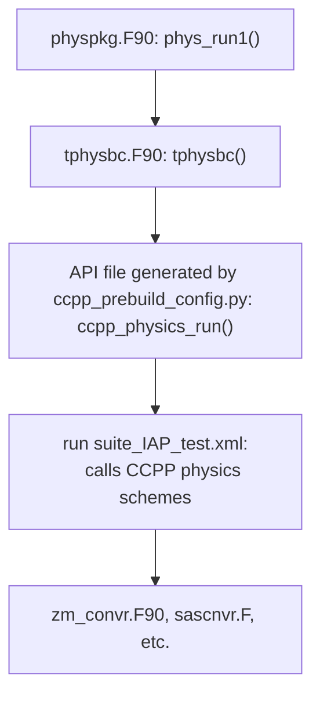
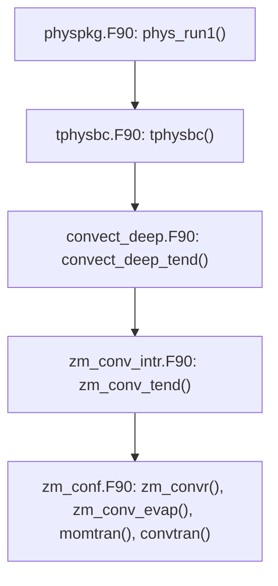

# IAP_cas-esm2
This repository contains the model source code and scripts for the IAP CCPP project.
The initial code commit is based on tarfiles received in early 2020 by Lulin from Institute of Atmospheric Physics (IAP).

## Resources
- [Description and Climate Simulation Performance of CAS-ESM Version 2](https://agupubs.onlinelibrary.wiley.com/doi/full/10.1029/2020MS002210) paper
- [CCPP Documentation](https://ccpp-techdoc.readthedocs.io)
- CCPP Codebases
  - [CCPP Physics](https://github.com/NCAR/ccpp-physics)
  - [CCPP Framework](https://github.com/NCAR/ccpp-framework)
- [CAM5 Scientific Documentation](https://ncar.github.io/CAM/doc/build/html/cam5_scientific_guide/index.html)

The Community Earth System Model (CESM) Coupler infrastructure is used and the CESM1.0 documentation can be useful.
- [CESM1.0 Documenation](https://www2.cesm.ucar.edu/models/cesm1.0/cesm/)


# Building and Running the Model
## Prerequisites
- C and Fortran Compiler
- NetCDF
- MPI

## Build
After cloning the repository retrieve CCPP Framework and CCPP-Physics repos.
```
$ git submodule update --init --recursive
```

### Setup Machine
Make sure the machine being used is listed under `scripts/ccsm_utils/Machines/`
as `Macros.mach` where `mach` is the name of the machine
If the machine in not listed the user will need to create the setup for a new
machine by following the CESM1.0 [Porting to a new machine](https://www2.cesm.ucar.edu/models/cesm1.0/cesm/cesm_doc_1_0_6/c2239.html)
documentation.
The file `Macros.mach` sets variables like `FFLAGS` so if the user wants to
switch compilers they will need to modify these flags.
NOTE: The NetCDF macro values will most likely need to be updated by the user
using the output from the `nc-config` and `nf-config` executables.

### Setup and Build Case
```
Setup environment variables that aren't handled in Macros.mach
$ export DIN_LOC_ROOT=path/to/iap/inputdata

Variables that are used by every user can be updated in Macros.mach
$ export NETCDF_PATH=$NETCDF

Switch to CCPP to run CCPP Framework Prebuild steps, required everytime subroutines change
$ ./switch_to_ccpp.sh
$ cd scripts

User can also run without CCPP
$ ./switch_to_no_ccpp.sh
$ cd scripts

Choose case from list of avaible cases
$ ./create_newcase -list

The following is an example of the FAMIPC5_FD14 case on Derecho
$ ./create_newcase \
    -case FAMIPC5_FD14 \
    -compset FAMIPC5 \
    -res fd14_fd14 \
    -mach derecho \
    -din_loc_root_csmdata path/to/inputdata


Need to give that configure the correct permissions to run
$ chmod +x [base directory]/models/atm/cam/bld/configure
$ cd FAMIPC5_FD14
$ ./configure -case

<!-- NOT NEEDED ANYMORE -->
<!-- Remove "bnd_topo2 =..." line from Buildconf/cam.input_data_list with an editor -->
<!-- or run the following command -->
<!-- $ sed -i '/^bnd_topo2/d' Buildconf/cam.input_data_list -->

NOTE: On Derecho the NetCDF C and Fortran builds are in different locations.
  1. File scripts/ccsm_utils/Machines/Macros.derecho was changed to handle
     NetCDF environment variables when C and Fortran installs are in different
     locations

$ ./FAMIPC5_FD14.derecho.build

NOTE: During this process the pio library might fail to build. The build does
  not fail gracefully, meaning if you fix the issue reported in the log, the
  user might need to clean the build and try again. The user might need to go
  to the BUILD/pio/ directory and manually run ./configure to find why the
  build process is failing. The configure.status file will not be created
  until ./configure successfully runs.
  - File models/utils/pio/configure was changed to handle when NetCDF C and
    NetCDF Fortran are installed in different directories.
    Variables netcdf_c_ROOT and netcdf_fortran_ROOT will be automatically set
    if they are not defined.
  - Once the user has debugged the cause they can edit
    `scripts/ccsm_utils/Machines/env_machopts.[machine_name] for a more
    permanent fix.

```

### Run Case
The bash script will handle the setup and running of the code and is preferable
to manually running `mpiexec` but that option is explained below.

```
To edit the namelists before running the user may need to change to the
run directory, for instanct to edit the number of days to run change
the stop_n value in drv_in
$ cd [SCRATCH_DIR]/FAMIPC5_FD14/run
$ emacs drv_in
```

```
Run as bash script from [project_dir]/scripts/FAMIPC5 directory using an
interactive node if needed
$ ./FAMIPC5_FD14.derecho.run

OR

Submit as batch script after modifying to match the user's system
$ qsub ./FAMIPC5_FD14.derecho.run

OR

Change to scratch directory with the testcase run directory, create directory
for timing and checkpoint information to be written to, run testcase
$ cd [scratch_directory]/FAMIPC5_FD14/run
$ mkdir -p timing/checkpoints
$ mpiexec -np 128 ./ccsm.exe &> log.txt

```


# Directory Structure
Note, the whole directory structure is not shown, just a few directories important for this project.
```
IAP_cas-esm2/
├──models/
│   └──atm/iap
│       ├──ccpp/
│       │   ├──config/
│       │   ├──framework/
│       │   ├──physics/
│       │   └──suites/
│       └──src/
│           ├──physics/
│           └──dynamics/
└──scripts/
    ├──SourceMods/
    └──ccsm_utils/
```

<!-- # Background Information -->
<!-- <TODO> -->


<!-- ## Adding CCPP Physics Schemes -->
<!-- <TODO> -->
<!-- The following is a guide on adding a CCPP physics scheme. -->
<!-- The [CCPP Documentation](https://ccpp-techdoc.readthedocs.io/en/v7.0.0/) has the most indepth information on this process and might be useful. -->


<!-- ### Instructions -->
<!-- <TODO> -->
<!-- Setting up a physics suite for use with the CCPP framework involves three steps: -->
<!--  - preparing data to be made available to physics through the CCPP -->
<!--  - running the ccpp_prebuild.py script to reconcile SCM-provided variables with physics-required variables -->
<!--  - preparing a suite definition file. -->

# Using CCPP Physics in IAP


## Instructions


## Scheme Tables

| IAP Schemes Added to CCPP Physics |
|-----------------------------------|
| Zhang-McFarlane convection scheme |


| CCPP Physics Scheme Name                                         |
|------------------------------------------------------------------|
| IAP's Zhang-McFarlane deep convection                            |
| scale-aware Simplified Arakawa-Schubert (sa-SAS) deep convection |


### Adding a CCPP Physics Scheme to IAP
The build system is setup to build all `.F90,.f90,.F,.f` files in the
`modules/atm/iap/src/physics` directory so the easiest way to make sure CCPP
physics files are compiled is to bring them over to that directory.
The user could also instead edit the `models/atm/cam/bld/configure` file but
this is much more complicated.

The following instructions follow the procedure for adding sa-SAS deep
convection but can be generalized to other CCPP Physics schemes.

#### Steps
- Create copy of physics scheme files. There will need to be slight changes
  to get it working with IAP's physics.
```
$ cd models/atm/iap/src/physics
$ cp sascnvn.F sascnvnr.F
```

-  Create a symlink from `models/atm/iap/ccpp/physics/phyics/foo.F90` into
   `models/atm/iap/src/physics`
```
$ cd models/atm/iap/src/physics
$ ln -s ../../ccpp/physics/physics/foo.F90 .
```

-  Check corresponding `foo.meta` file for dependencies are create symlinks for
   those as well. For the `sascnvnr.F` file two additional dependency files were
   needed. The following was use
```
$ ln -s ../../ccpp/physics/physics/sascnvnr.F .
$ ln -s ../../ccpp/physics/physics/machine.F .
$ ln -s ../../ccpp/physics/physics/funcphys.f90 .
$ ln -s ../../ccpp/physics/physics/physcons.F90 .
```

- Add the symlinked files in the `models/atm/iap/src/physics` directory
   to `.gitignore`

-  Mapping arguments
Every CCPP physics scheme will have a corresponding `.meta` file that lists the
subroutines and lists the details of the arguments.
Every subroutine should have two additional arguments for the error code and
message.

| Function            | Argument         | Details                                                  | IAP Variable |
|---------------------|------------------|----------------------------------------------------------|--------------|
| `sascnvnr_init`     | `imfdeepcnv`     | flag for mass-flux deep convection scheme                |              |
|                     | `imfdeepcnv_sas` | flag for mass-flux deep convection scheme                |              |
|                     |                  |                                                          |              |
| `sascnvnr_run`      | `grav`           | gravitational acceleration                               |              |
|                     | `cp`             | specific heat of dry air at constant pressure            |              |
|                     | `hvap`           | latent heat of evaporation/sublimation                   |              |
|                     | `rv`             | ideal gas constant for water vapor                       |              |
|                     | `fv`             | (rv/rd) - 1 (rv = ideal gas constant for water vapor)    |              |
|                     | `t0c`            | temperature at 0 degree Celsius                          |              |
|                     | `rgas`           | ideal gas constant for dry air                           |              |
|                     | `cvap`           | specific heat of water vapor at constant pressure        |              |
|                     | `cliq`           | specific heat of liquid water at constant pressure       |              |
|                     | `eps`            | rd/rv                                                    |              |
|                     | `epsm1`          | (rd/rv) - 1                                              |              |
|                     | `im`             | horizontal loop extent                                   |              |
|                     | `km`             | number of vertical levels                                |              |
|                     | `jcap`           | number of spectral wave trancation used only by          |              |
|                     |                  | sascnvn                                                  |              |
|                     | `delt`           | physics timestep                                         |              |
|                     | `delp`           | air pressure difference between midlayers                |              |
|                     | `prslp`          | mean layer pressure                                      |              |
|                     | `psp`            | surface pressure                                         |              |
|                     | `phil`           | geopotential at model layer centers                      |              |
|                     | `qlc`            | ratio of mass of cloud water to mass of dry air plus     |              |
|                     |                  | vapor (without condensates) in the convectively          |              |
|                     |                  | transported tracer array                                 |              |
|                     | `qli`            | ratio of mass of ice water to mass of dry air plus vapor |              |
|                     |                  | (without condensates) in the convectively transported    |              |
|                     |                  | tracer array                                             |              |
|                     | `q1`             | water vapor specific humidity updated by physics         |              |
|                     | `t1`             | temperature updated by physics                           |              |
|                     | `u1`             | zonal wind updated by physics                            |              |
|                     | `v1`             | meridional wind updated by physics                       |              |
|                     | `cldwrk`         | cloud work function                                      |              |
|                     | `rn`             | deep convective rainfall amount on physics timestep      |              |
|                     | `kbot`           | index for cloud base                                     |              |
|                     | `ktop`           | index for cloud top                                      |              |
|                     | `kcnv`           | deep convection: 0=no, 1=yes                             |              |
|                     | `islimsk`        | landmask: sea/land/ice=0/1/2                             |              |
|                     | `dot`            | layer mean vertical velocity                             |              |
|                     | `ncloud`         | number of cloud condensate types                         |              |
|                     | `ud`             | (updraft mass flux) * delt                               |              |
|                     | `dd`             | (downdraft mass flux) * delt                             |              |
|                     | `dt`             | (detrainment mass flux) * delt                           |              |
|                     | `cnvw`           | moist convective cloud water mixing ratio                |              |
|                     | `cnvc`           | convective cloud cover                                   |              |
|                     | `qlcn`           | mass fraction of convective cloud liquid water           |              |
|                     | `qicn`           | mass fraction of convective cloud ice water              |              |
|                     | `w`              | vertical velocity for updraft                            |              |
|                     | `cf`             | convective cloud fraction for microphysics               |              |
|                     | `cnv`            | detrained mass flux                                      |              |
|                     | `cnv`            | tendency of cloud water due to convective microphysics   |              |
|                     | `clcn`           | convective cloud volume fraction                         |              |
|                     | `cnv`            | ice fraction in convective tower                         |              |
|                     | `cnv`            | droplet number concentration in convective detrainment   |              |
|                     | `cnv`            | crystal number concentration in convective detrainment   |              |
|                     | `mp`             | choice of microphysics scheme                            |              |
|                     | `mp`             | choice of Morrison-Gettelman microphysics scheme         |              |
|                     | `clam`           | entrainment rate coefficient for deep convection         |              |
|                     | `c0`             | convective rain conversion parameter for deep convection |              |
|                     | `c1`             | convective detrainment conversion parameter for deep     |              |
|                     |                  | convection                                               |              |
|                     | `betal`          | downdraft fraction reaching surface over land for deep   |              |
|                     |                  | convection                                               |              |
|                     | `betas`          | downdraft fraction reaching surface over water for deep  |              |
|                     |                  | convection                                               |              |
|                     | `evfact`         | convective rain evaporation coefficient for deep         |              |
|                     |                  | convection                                               |              |
|                     | `evfactl`        | convective rain evaporation coefficient over land for    |              |
|                     |                  | deep convection                                          |              |
|                     | `pgcon`          | reduction factor in momentum transport due to deep       |              |
|                     |                  | convection induced pressure gradient force               |              |
|                     |                  |                                                          |              |
| `sascnvnr_finalize` |                  | No arguments and empty routine                           |              |

- Call Graph With CCPP: when running with CCPP `tphysbc.F90` calls CCPP physics instead
  of functions from `convect_deep.F90`.



- Original Call Graph Without CCPP: when running without CCPP `tphysbc.F90` calls functions
  from `convect_deep.F90`.


- In case's scratch `run` directory edit the `atm_in` namelist file.
  Change the namelist group `phys_ctl_in`'s `deep_scheme` varaible.
  This walkthrough is describing adding the deep convection scheme sa-SAS so
  to test it change it to `deep_scheme = 'saSAS'`


### Bringing CCPP Physics into IAP
- make a copy of the desired CCPP physics scheme, it will need to be modified to match the types of the IAP host
variables. If `foo.F90` was copied to `foor.F90`, make sure that all the modules and subroutines in `foor` are renamed
to `foor`.

- modify the `SCHEME_FILES` variable in the `ccpp_prebuild_config.py` file to have the new scheme file. In this case
  `ccpp/physics/physics/sascnvnr.F` was addded, which was a copy of `sascnvn.F`
- the kind types will be different so in the `.meta` file change `kind_phys` to `shr_kind_r8` and in the `.F/.F90`
file comment out and add like the following:
```
  ! use machine ,   only : kind_phys
  use shr_kind_mod, only: kind_phys => shr_kind_r8
```
- the control variable was an integer in one scheme and a character string in the IAP one, those had to be modified

- start running `ccpp_prebuild_config.py` and debugging the differences in types. The `.meta` files are read for the
  types and the prebuild will describe the difference with the host model. Change the type in both the `.meta` file
  and the `.F/.F90` file.
```
# foo.meta
[bar]
  standard_name = bar_value
  long_name = bar value
  type = real
  kind = shr_kind_r8  # originally kind kind_phys
```
- There will probably be variables that the ccpp physics will need that are not provided by the host IAP model or are
  called by a different name. These scheme variables need to be matched to the host variables that are provived by the
  files defined in the variable `VARIABLE_DEFINITIONS_FILE` in `ccpp_prebuild_config.py`.
  - The Single Column Model (SCM) is a host model that supports the CCPP Physics schemes. A scheme from the CCPP
    Physics will already be defined in one of the SCM's `SCHEME_FILES`. A user can copy a variables definition from one
    of  the SCM's `VARIABLE_DEFINITION_FILE`s.
  - To set the variable the physics scheme needs to a variable provided by the host model the user can set it in the host
    model. An example of this is in `models/atm/iap/src/physics/physics_types.F90`. After calling `ccpp_physics_run`
    local variables are set to CCPP variables.
  - Another way to is to define `sascnvnr_pre.F, sascnvnr_pre.meta` and `sascnvnr_post.F, sascnvnr_post.meta` files. As
    subroutine variables these would take CCPP variables whose data need to be copied to the hostmodel or set by the
    hostmodel. The files could then load variables from IAP modules and set and/.or conversion to CCPP variables as
    needed./


### ZM CCPP Complient Notes
The following is a rough guide for how the IAP's ZM convection scheme was
modified to be make its [physics parameterizations CCPP compliant](https://ccpp-techdoc.readthedocs.io/en/latest/CompliantPhysicsParams.html).

The IAP's version of `zm_conv.F90`, found in `models/atm/iap/src/physics/`, and is
a near identical version of CAM's `zm_conv.F90`, found in `models/atm/cam/src/physics/cam/zm_conv.F90`.
A copy of the ZM convection scheme was made CCPP complient and named
`zm_convr.F90` and can be found in a fork of the CCPP Physics repository, in
the branch [feature/iap_dom](https://github.com/NCAR/ccpp-physics/compare/main...climbfuji:ccpp-physics:feature/iap_dom).

The following files were added to CCPP Physics
| files                      | .meta file | from                            |
|----------------------------|------------|---------------------------------|
| `cldwat_ccpp.F90`          | no         | `physics/cam/cldwat.F90`        |
| `iap_ptend_sum.F90`        | no         | `physics/cam/physics_types.F90` |
| `iap_state_update.F90`     | no         | `physics/cam/physics_types.F90` |
| `zm_conv_all_post.F90`     | yes        |                                 |
| `zm_conv_common.F90`       | no         |                                 |
| `zm_conv_convtran.F90`     | yes        |                                 |
| `zm_conv_evap.F90`         | yes        |                                 |
| `zm_conv_evap_post.F90`    | yes        |                                 |
| `zm_conv_momtran.F90`      | yes        |                                 |
| `zm_conv_momtran_post.F90` | yes        |                                 |
| `zm_convr.F90`             | yes        | `physics/cam/zm_conv.F90`       |
| `zm_convr_post.F90`        | yes        |                                 |


This CCPP complient ZM version is then brought back into the IAP physics as an
example of how to integrate CCPP physics scheme into IAP's.
The CCPP complient ZM version is tested in `ccpp_IAP_test_test1_cap.F90`

`#ifdef CCPP` macros have been added to the following files in `models/atm/iap/src/physics`
| files                   | changes                                                    |
|-------------------------|------------------------------------------------------------|
| `./initindx.F90`        |                                                            |
|                         | `use physics_register,   only: convect_deep_register`      |
| `./buffer.F90`          |                                                            |
|                         | `real(r8), allocatable, target, dimension(:,:) :: &`       |
|                         | `pblht, tpert, tpert2, qpert2`                             |
|                         | `real(r8), allocatable, target, dimension(:,:,:) :: &`     |
|                         | `qpert`                                                    |
| `./cam_diagnostics.F90` |                                                            |
|                         | `use phys_control, only: cam_physpkg_is`                   |
|                         | `public: diag_tphysbc`                                     |
|                         | `character(len=16) :: deep_scheme`                         |
|                         | ZM case to add variables using `cam_history`'s `addfld`    |
|                         | subroutine `diag_tphysbc` for output                       |
| `./tphysbc.F90`         |                                                            |
|                         | `cam_out, cam_in` arguments to `tphysbc` subroutine        |
|                         | `use ccpp_data,       only: phys_int_ephem`                |
|                         | `use ccpp_static_api, only: ccpp_physics_run`              |
|                         | `use ccpp_types,      only: ccpp_t`                        |
|                         | call `ccpp_physics_run` and copy data back to IAP vars     |
|                         | - do this for `convect_deep_tend, convect_deep_tend2`      |
| `./runtime_opts.F90`    |                                                            |
|                         | `call cldwat_readnl_ccpp(nlfilename)`                      |
|                         | `subroutine zmconv_readnl`                                 |
| `./physpkg.F90`         |                                                            |
|                         | this file provides the interface for CAM physics packages  |
|                         | subroutines in the `physpkg` module are                    |
|                         | - `phys_inidat`                                            |
|                         | - `phys_init`                                              |
|                         | - `phys_run1`                                              |
|                         | - `phys_run1_adiabatic_or_ideal`                           |
|                         | - `phys_run2`                                              |
|                         | - `phys_final`                                             |
|                         | - `cdata_init`: added by CCPP                              |
|                         | CCPP adds arguments to `phys_{init, run1, final}` routines |
| .`/physics_types.F90`   |                                                            |
|                         | Adds subroutines                                           |
|                         | - `interstitial_ephemeral_create`                          |
|                         | - `interstitial_ephemeral_reset`                           |
|                         | - `interstitial_persistent_associate`                      |
|                         | - `interstitial_persistent_create`                         |
|                         | - `interstitial_persistent_init`                           |
|                         | - `physics_global_init`                                    |


<!-- - [PR#1](https://github.com/lulinxue/IAP_cas-esm2/pull/1) -->
<!--   - [ ] track down email referenced in the PR -->
<!-- commit messages   -->
<!-- - add CCPP framework and physics as submodules (master branches for now) -->
<!-- - add initial ccpp_prebuild_config.py and SDF (with xsd) -->
<!-- - save work for ZM convection (incomplete) | commiting work-in-progress code as of 20210713 -->
<!-- - update comments for where everything went in zm_conv_intr.F90 for others to follow -->
<!-- - first version of host files that pass ccpp_prebuild.py -->
<!-- - add CCPP API calls; reconfigure ccpp_prebuild_config.py to write compilable caps -->
<!-- - update ccpp/physics submodule pointer, fix error in physpkg.F90, add -DCCPP to Cheyenne macros file -->
<!-- - fix compilation errors in buffer.F90 and physics_types.F90 -->
<!-- - change kind_r8 to shr_kind_r8 in metadata | fix compilation errors -->
<!-- - move data accessed by CCPP from cam_comp.F90 to ccpp_data.F90 -->
<!-- - changes to enable first successful compilation -->
<!-- - Update .gitmodules | Update machine and case config to work for Dom -->
<!-- - Bugfixes for phys_global and cdata_domain -->
<!-- - Remove unused models/atm/cam/src/control/cam_comp.meta -->
<!-- - Make ccpp_data local variables in -->
<!--   models/atm/iap/src/physics/physpkg.F90. Correct metadata for several DDTs in -->
<!--   models/atm/cam/src/dynamics/iap/ccpp_data.F90 -->
<!-- - Add metadata for cam_out_t in models/atm/cam/src/control/camsrfexch_types.* -->
<!-- - Update ccpp-framework and ccpp-physics from NCAR main, update host model metadata -->
<!-- - Major bug fix in cam/src/cpl_mct/atm_comp_mct.F90: import 'cam_in' from -->
<!--   ccpp_data instead of defining it locally  | Update submodule pointer for ccpp-framework -->
<!-- - Remove unused nchnks -->
<!-- - Add metadata for begchunk and endchunk in models/atm/iap/src/physics/ppgrid.meta -->
<!-- - Bug fixes in models/atm/iap/src/physics/buffer.meta: use correct CCPP block numbers and kinds -->
<!-- - Add buffer.F90/meta to models/atm/iap/ccpp/config/ccpp_prebuild_config.py -->
<!-- - Remove unused/wrong metadata table hooks from models/atm/cam/src/cpl_esmf/atm_comp_esmf.F90 -->
<!-- - Temporary or permanent? Use assumed-shape array declarations in models/atm/iap/src/physics/convect_shallow.F90 -->
<!-- - Clean up in models/atm/iap/src/physics/physics_types.* -->
<!-- - Add temporary debugging information in models/atm/iap/src/physics/tphysbc.F90 -->
<!-- - Bug fix in models/atm/iap/src/physics/physpkg.F90: correct thread number in Fortran is 1..N -->
  <!-- - Add CCPP prebuild config for IAP AGCM -->
  <!-- - Add Suite Definition File (SDF): `suite_IAP_test.xml` -->
  <!-- - Make [CCPP compliant](https://ccpp-techdoc.readthedocs.io/en/latest/CompliantPhysicsParams.html) -->
  <!--   - Add metadata by adding `.meta` files for `.F90` files that will be -->
  <!--     access by framework -->
  <!--     - `IAP_physics_ephemeral_interstitial_instance_all_blocks` -->
  <!--     - `IAP_physics_persistent_interstitial_instance_all_blocks` -->
  <!--     - `IAP_physics_global_instance` -->
  <!-- - Add `#ifdef CCPP` macros -->

<!-- - [PR#2](https://github.com/lulinxue/IAP_cas-esm2/pull/2) Feature/iap dom 2 -->
<!-- I had to CCPP-ize `convect_deep_tend_2` (there was no way to do the first part -->
<!-- in CCPP and the second outside of CCPP), create a separate group in the XML -->
<!-- SDF. I also had to fix several bugs along the way, and update ccpp-framework -->
<!-- and ccpp-physics with the latest code from NCAR main. This made it possible to -->
<!-- get rid of the `dummy_loop` scheme. -->

<!-- After returning from tphysbc - and all state/pbuf variables being identical -->
<!-- for all MPI tasks and all chunks - the code crashes in the newly created CCPP -->
<!-- diag output call. I tested this, if I simply bypass the diag output then it -->
<!-- crashes later on in a nother diag routine from other parts of the model -->
<!-- (somewhere in the dynamics). So what I did is to stop the model after the -->
<!-- first pass through the physics. -->

<!-- The ccpp-framework changes are probably not of interest, but in the -->
<!-- ccpp-physics changes I would look for the changes in the `zm_*.{F90,meta}` -->
<!-- files. -->

<!-- commit messages   -->
<!-- -- Wrap contents of module ccpp_data in #ifdef CCPP -->
<!-- -- Remove dummy_loop from models/atm/iap/ccpp/config/ccpp_prebuild_config.py, add STATIC_API_SOURCEFILE -->
<!-- -- Add group test2 to models/atm/iap/ccpp/suites/suite_IAP_test.xml -->
<!-- -- Remove temporary testing code from models/atm/iap/src/physics/convect_shallow.F90 -->
<!-- -- Update submodule pointers for ccpp-framework and ccpp-physics -->
<!-- -- Read cldwat namelists for both CCPP and non-CCPP code -->
<!-- -- Add DDT print routines to models/atm/iap/src/physics/physics_types.F90,  -->
<!-- add new DDT members to models/atm/iap/src/physics/physics_types.{F90,meta} -->
<!-- -- Initialize cldwat for both non-CCPP and CCPP physics in models/atm/iap/src/physics/physpkg.F90 -->
<!-- -- Change default debug levels in scripts/ccsm_utils/Case.template/config_definition.xml -->
<!-- -- Change FFLAGS_NOOPT in scripts/ccsm_utils/Machines/Macros.cheyenne -->
<!-- -- Convenience scripts for quickly switching between CCPP and non-CCPP code -->
<!-- -- Temporary change in models/atm/cam/src/physics/cam/phys_buffer.F90 - -->
<!--    initialize phys_buffer fld_ptr to 0.0 instead of NaN so that it can be printed -->
<!--    using tphysbc.F90 -\-> pbuf_print_data -->
<!-- -- Initialize cldwat for CCPP and no CCPP, add temporary stop of code after calling tphysbc for all chunks -->
<!-- -- models/atm/iap/src/physics/tphysbc.F90: CCPP-ize convect_deep_tend_2, -->
<!--    transfer CCPP interstitial data to local arrays, add debugging prints, more -->
<!--    bugfixes -->
<!-- -- One more print statement in models/atm/iap/src/physics/physpkg.F90 -->
<!-- -- Final touches -->
